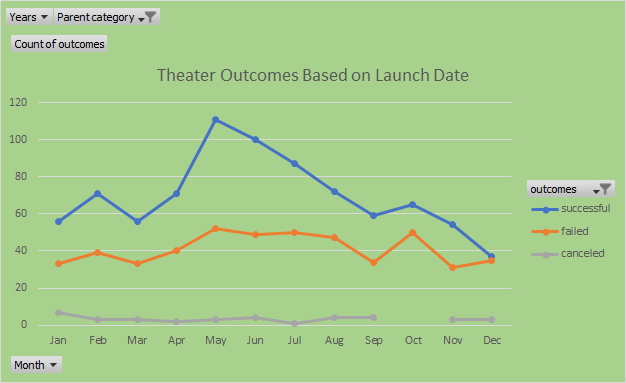

# Kickstarting with Excel; 

## The purpose of this project is to provide a report to Louise who has completed fundraising campaign for her play Fever, by analyzing and visualizing of Kickstarter Campaign data. She came close to her fundraising, now she would like to know how well different campaigns did in relation based on their launch date and their funding goal. 

## Analysis and Challenges 
### Analysis of Outcomes Based on Launch Date.
To perform this analysis, I created a pivot table from Kickstarter worksheet. I filtered the pivot table based on “Parent category” and “Years”. Then I placed the outcomes (Successful, Canceled, Failed) in the columns and the launch months in the rows. I filtered the Data by parent category, theater. Then I created a line chart from the pivot table to visualize the relationship between outcomes and launch month. A challenge with completing thing analysis is to get outcomes to display correctly in the Pivot table. This data did not automatically appear as needed. I had to use the grouping function in Pivot Table Analyze menu to resolve it. 
### Analysis of Outcomes Based on Goals.
To perform this analysis I created a sheet, with goal amounts for the rows and the number of successful, failed, and Canceled campaigns and used COUNTIFS () functions to populate the "Number Successful," "Number Failed," and "Number Canceled" columns by filtering on the Kickstarter "outcome" column, on the "goal" amount column and on the "Subcategory" column using "plays" as the criteria. Then I used the SUM() function to populate the "Total Projects" column with the number of successful, failed, and canceled projects for each row. After calculating the percentage of successful, failed, and canceled projects for each row, I created a line chart to visualize the relationship between the goal-amount ranges on the x-axis and the percentage of successful, failed, or canceled projects on the y-axis. This chart gives a great visual representation of the Data. Another potential challenge was completing COUNTIFS functions in this analysis. Using this new function which accepts several criteria, like a cell range for the column of interest and the criteria to filter data from that column was pretty challenging. Especially when I forgot to type (s) at the end of COUNTIF, it does not allow to filter on the Kickstarter "outcome" column, on the "goal" amount column using the ranges and on the "Subcategory" column using "plays" at the same time. Then when I added (s) letter at the end of the COUNTIF, like COUNTIFS it worked.

 
-	There two conclusions I can draw about the Theater Outcomes based on Launch Date chart above. Firstly, we can easily see from this line chart which parent categories performed well and which ones did not, the month that launched the most successful Kickstarter campaigns was May followed by June and July. However, October, July, and August all had roughly the same number of failed campaigns launched. This can be determined by examining the points along the trend lines of the chart.

 
-   We have found from the line chart above that while there are only total 76 percentage of successful Kickstarter campaigns for plays in based on the funding goal amount less than $1000 is the most successful. However, the funding goal amount $1000 to $4999, and $35000 to $39999, $40000 to $44999 were successful too. In general, the higher goal amount the lower success rate, but $35000 to $44999 there was an exception and success rate pretty good. This can be determined by examining the points along the trend lines of the chart which is created and saved as Outcomes_vs_Goals.png with the goal-amount ranges on the x-axis, the percentage of successful, failed, or canceled projects on the y-axis.

   ## So, Theater Outcomes based on Launch Data is that May is the best month, October is the worth one and Kickstarter campaigns for plays in based on the funding goal amount less than $1000 is the most successful.
-	This data was from only one year and it would be interesting to compare results across many years.
-	This is a line chart but a bar charts might work well. Also bubble charts would be interesting. 

